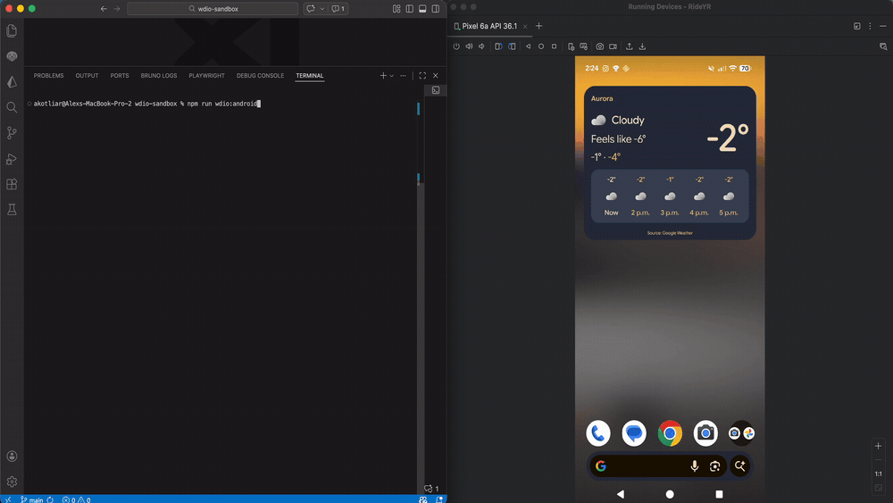

# RideYR Mobile Automation Testing Suite

A comprehensive mobile automation testing framework for the RideYR application using WebDriverIO, Appium, and Cucumber BDD.

## Demo



## Overview

This project provides automated testing capabilities for the RideYR mobile application across Android and iOS platforms. It includes end-to-end testing scenarios for key features like homescreen navigation, stop code search, and service alerts.

## Features

- **Cross-platform testing** - Android and iOS support
- **BDD testing** with Cucumber and Gherkin
- **Page Object Model** architecture
- **Comprehensive reporting** with Allure
- **CI/CD ready** configuration
- **After hooks** for cleanup and navigation

## Tech Stack

- **WebDriverIO** - Browser and mobile automation
- **Appium** - Mobile app automation
- **Cucumber** - BDD framework for Gherkin scenarios  
- **TypeScript** - Type safety and better development experience
- **Allure** - Test reporting and analytics

## Prerequisites

- Node.js (v16 or higher)
- Android Studio / Xcode (for emulators)
- Appium drivers installed
- RideYR app APK/IPA files

## Installation

1. Clone the repository:
```bash
git clone <repository-url>
cd wdio-sandbox
```

2. Install dependencies:
```bash
npm install
```

3. Install Appium drivers:
```bash
npx appium driver install uiautomator2
npx appium driver install xcuitest
```

## Configuration

### Android Setup
- Configure Android emulator or device
- Update `wdio.android.conf.ts` with device capabilities
- Place APK file in appropriate location

### iOS Setup  
- Configure iOS simulator or device
- Update `wdio.ios.conf.ts` with device capabilities
- Place IPA file in appropriate location

## Usage

### Run Tests

**Android:**
```bash
npm run wdio:android
```

**iOS:**
```bash
npm run wdio:ios
```

**All platforms:**
```bash
npm run wdio
```

### Test Structure

```
test/
├── features/
│   ├── homescreen.feature          # BDD scenarios
│   └── support/
│       └── hooks.ts                # Test hooks and navigation
├── pageobjects/
│   └── home.screen.ts              # Page object models
└── step-definitions/
    └── steps.ts                    # Step implementations
```

## Test Scenarios

### Homescreen Features
- ✅ Stop code search functionality
- ✅ Service alerts viewing
- ✅ Navigation between tabs
- ✅ Homescreen restoration after scenarios

### Page Objects
- `HomeScreen` - Main app homescreen interactions
- Cross-platform selector strategies
- Resource ID and XPath selectors

## Hooks & Navigation

The framework includes after hooks for reliable test cleanup:
```typescript
@navigateHome // Ensures return to homescreen after test
```

## Reporting

Test results are generated using:
- Allure Reporter - Detailed test reports with screenshots
- Spec Reporter - Console output during test runs
- Dot Reporter - Minimal progress indicators

## Project Structure

```
├── assets/                    # Demo videos and images
├── test/
│   ├── features/             # Cucumber feature files
│   ├── pageobjects/          # Page object models
│   └── step-definitions/     # Cucumber step implementations
├── wdio.android.conf.ts      # Android test configuration
├── wdio.ios.conf.ts          # iOS test configuration
├── wdio.conf.ts              # Base configuration
└── package.json              # Dependencies and scripts
```

## Contributing

1. Fork the repository
2. Create a feature branch
3. Add tests for new features
4. Run the test suite
5. Submit a pull request

## Troubleshooting

### Common Issues

**Hook not executing:**
- Verify tag syntax matches exactly: `@navigateHome`
- Ensure hooks file is imported in WebDriverIO config
- Check cucumber requires configuration

**Element not found:**
- Use Appium Inspector to verify selectors
- Try multiple selector strategies (resource-id, xpath, text)
- Add explicit waits for dynamic elements

**Cross-platform compatibility:**
- Use platform-specific selectors when needed
- Leverage xpath for broader compatibility
- Test on both Android and iOS regularly

---

Built with ❤️ for reliable mobile app testing